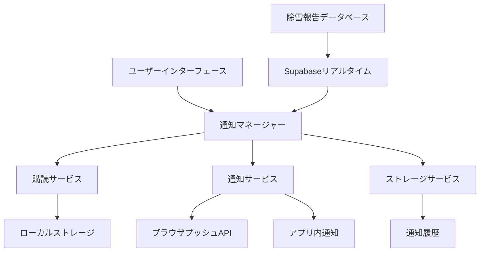

# 設計書

## 概要

リアルタイム通知システムは、既存の稚内市除雪情報システムを拡張し、除雪作業の開始または終了時に即座に通知を提供します。このシステムは、Supabaseのリアルタイム機能、ブラウザプッシュ通知、ユーザー設定のローカルストレージを活用します。設計は信頼性、パフォーマンス、ユーザーエクスペリエンスに焦点を当て、既存のVue 3/Nuxt 3アーキテクチャとシームレスに統合されます。

## アーキテクチャ

### 高レベルアーキテクチャ



### システムコンポーネント

1. **通知マネージャー**: すべての通知操作の中央オーケストレーター
2. **購読サービス**: ユーザーの地域購読と設定を管理
3. **通知サービス**: 複数チャネルを通じた通知配信を処理
4. **ストレージサービス**: 設定と通知履歴のローカルストレージを管理
5. **リアルタイムリスナー**: Supabaseリアルタイム購読を通じてデータベース変更を監視

## コンポーネントとインターフェース

### コアコンポーネント

#### NotificationManager (Composable)
```typescript
interface NotificationManager {
  initialize(): Promise<void>  // 初期化
  subscribe(area: string): Promise<void>  // 地域購読
  unsubscribe(area: string): Promise<void>  // 購読解除
  getSubscriptions(): string[]  // 購読リスト取得
  enableNotifications(): Promise<boolean>  // 通知有効化
  disableNotifications(): void  // 通知無効化
}
```

#### NotificationSettings (Vue Component)
- 場所: `components/feature/notifications/NotificationSettings.vue`
- 目的: 通知設定を管理するユーザーインターフェース
- 機能:
  - 地域購読管理
  - 通知タイプ設定
  - 許可リクエスト処理

#### NotificationHistory (Vue Component)
- 場所: `components/feature/notifications/NotificationHistory.vue`
- 目的: 過去の通知をユーザーに表示
- 機能:
  - 時系列通知リスト
  - 地域と日付によるフィルタリング
  - 履歴クリア機能

#### NotificationToast (Vue Component)
- 場所: `components/ui/NotificationToast.vue`
- 目的: アプリ内通知表示
- 機能:
  - 自動消去機能
  - アクションボタン（詳細表示）
  - 複数通知のキューイング

### APIインターフェース

#### 通知購読API
```typescript
interface SubscriptionData {
  areas: string[]  // 購読地域リスト
  enablePush: boolean  // プッシュ通知有効
  enableInApp: boolean  // アプリ内通知有効
  userId?: string  // ユーザーID（オプション）
}
```

#### 通知イベントデータ
```typescript
interface NotificationEvent {
  id: string  // 通知ID
  area: string  // 地域名
  type: 'start' | 'end'  // 作業タイプ（開始/終了）
  timestamp: string  // タイムスタンプ
  reportId: number  // 報告ID
}
```

## データモデル

### ローカルストレージスキーマ

#### ユーザー設定
```typescript
interface NotificationPreferences {
  subscriptions: string[]  // 購読地域リスト
  enablePush: boolean  // プッシュ通知有効
  enableInApp: boolean  // アプリ内通知有効
  lastUpdated: string  // 最終更新日時
}
```

#### 通知履歴
```typescript
interface NotificationHistoryItem {
  id: string  // 通知ID
  area: string  // 地域名
  type: 'start' | 'end'  // 作業タイプ（開始/終了）
  message: string  // 通知メッセージ
  timestamp: string  // タイムスタンプ
  read: boolean  // 既読フラグ
}
```

### Supabase統合

#### リアルタイム購読
- テーブル: `snow_reports`
- イベント: `INSERT`, `UPDATE`
- フィルター: 全レコード（地域ベースのフィルタリングはクライアント側で処理）

#### データベーストリガー（オプション拡張）
```sql
-- 通知用カスタムイベントを発行するトリガー
CREATE OR REPLACE FUNCTION notify_snow_report_change()
RETURNS TRIGGER AS $
BEGIN
  PERFORM pg_notify('snow_report_change', 
    json_build_object(
      'area', NEW.area,
      'type', CASE 
        WHEN TG_OP = 'INSERT' THEN 'start'
        ELSE 'update'
      END,
      'id', NEW.id,
      'timestamp', NEW.created_at
    )::text
  );
  RETURN NEW;
END;
$ LANGUAGE plpgsql;
```

## エラーハンドリング

### エラーカテゴリと対応

1. **許可拒否**: アプリ内通知への適切なフォールバック
2. **ネットワーク障害**: 指数バックオフによる再試行のための通知キューイング
3. **ストレージ障害**: セッション期間中のメモリベースフォールバック使用
4. **リアルタイム接続切断**: ステータスインジケーター付き自動再接続

### エラー回復戦略

```typescript
interface ErrorRecoveryConfig {
  maxRetries: 3  // 最大再試行回数
  baseDelay: 1000  // 基本遅延時間（ミリ秒）
  maxDelay: 30000  // 最大遅延時間（ミリ秒）
  fallbackToInApp: true  // アプリ内通知へのフォールバック
}
```

## テスト戦略

### 単体テスト

1. **通知マネージャーテスト**
   - 購読管理
   - 通知配信ロジック
   - エラーハンドリングシナリオ

2. **コンポーネントテスト**
   - NotificationSettingsユーザーインタラクション
   - NotificationHistoryデータ表示
   - NotificationToast動作

3. **サービステスト**
   - ローカルストレージ操作
   - プッシュ通知統合
   - リアルタイムイベント処理

### 統合テスト

1. **エンドツーエンド通知フロー**
   - データベース変更 → リアルタイムイベント → 通知配信
   - ユーザー購読 → 設定保存 → 通知フィルタリング

2. **クロスブラウザ互換性**
   - プッシュ通知サポート検出
   - ローカルストレージ可用性
   - リアルタイム接続安定性

### パフォーマンステスト

1. **スケーラビリティテスト**
   - 複数同時通知
   - 大規模購読リスト
   - メモリ使用量監視

2. **ネットワーク耐性**
   - オフライン/オンライン遷移
   - 低速ネットワーク条件
   - 接続中断回復

## 実装フェーズ

### フェーズ1: コアインフラストラクチャ
- 通知マネージャーcomposable
- ローカルストレージサービス
- 基本購読管理

### フェーズ2: ユーザーインターフェース
- 通知設定コンポーネント
- アプリ内通知システム
- 基本通知履歴

### フェーズ3: リアルタイム統合
- Supabaseリアルタイムリスナー
- イベント処理とフィルタリング
- 通知配信パイプライン

### フェーズ4: 拡張機能
- プッシュ通知サポート
- 高度なフィルタリングオプション
- 通知履歴管理

### フェーズ5: 最適化
- パフォーマンス改善
- エラーハンドリング改良
- クロスブラウザ互換性

## セキュリティ考慮事項

1. **データプライバシー**: すべての設定をローカル保存、サーバーサイドでのユーザー追跡なし
2. **許可処理**: 許可拒否時の適切な機能低下
3. **入力検証**: 地域名と通知内容のサニタイズ
4. **レート制限**: クライアントサイドスロットリングによる通知スパム防止

## パフォーマンス最適化

1. **遅延読み込み**: 必要時のみ通知コンポーネントを読み込み
2. **イベントデバウンス**: 高速データベース変更による重複通知防止
3. **メモリ管理**: 古い通知履歴の自動クリーンアップ
4. **接続プーリング**: 効率的なリアルタイム接続管理