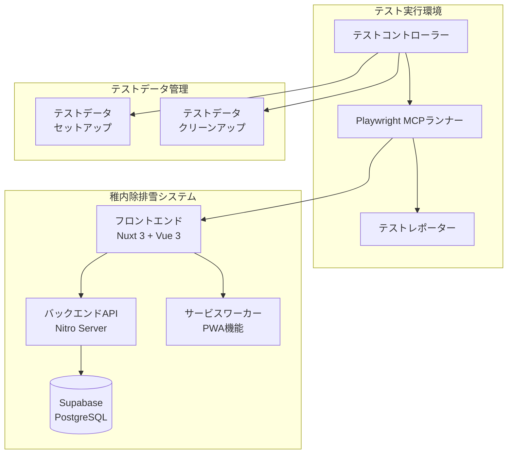

# 設計書

## 概要

稚内除排雪システムのユーザーワークフローテストシステムは、Playwright MCPを活用してブラウザベースのE2Eテストを実行し、フロントエンド、バックエンドAPI、データベース、PWA機能を包括的にテストします。このシステムは、実際のユーザー操作をシミュレートし、システム全体の動作を検証します。

## アーキテクチャ

### システム構成図



### テスト階層構造

1. **ユニットテスト層**: 個別コンポーネント・関数のテスト
2. **統合テスト層**: API エンドポイントとデータベースの統合テスト
3. **E2Eテスト層**: ブラウザベースのエンドツーエンドテスト
4. **ワークフローテスト層**: 複数ページにまたがるユーザージャーニーテスト

## コンポーネントとインターフェース

### 1. テストコントローラー (`TestController`)

**責任**: テスト実行の統括管理とデータセットアップ

```typescript
interface TestController {
  setupTestEnvironment(): Promise<void>
  executeTestSuite(suite: TestSuite): Promise<TestResult>
  cleanupTestData(): Promise<void>
  generateReport(results: TestResult[]): Promise<void>
}
```

**主要機能**:
- テストデータのセットアップとクリーンアップ
- テストスイートの実行順序制御
- テスト結果の集約と分析

### 2. Playwright MCPランナー (`PlaywrightRunner`)

**責任**: ブラウザ操作とページインタラクション

```typescript
interface PlaywrightRunner {
  navigateToPage(url: string): Promise<void>
  fillForm(formData: FormData): Promise<void>
  clickElement(selector: string): Promise<void>
  waitForElement(selector: string): Promise<void>
  takeScreenshot(name: string): Promise<void>
  verifyPageContent(expectations: ContentExpectation[]): Promise<boolean>
}
```

**主要機能**:
- ページナビゲーションとフォーム操作
- 要素の検索とインタラクション
- スクリーンショット取得とビジュアル検証
- 非同期処理の待機制御

### 3. APIテストクライアント (`ApiTestClient`)

**責任**: バックエンドAPIの直接テスト

```typescript
interface ApiTestClient {
  createSnowReport(data: SnowReportData): Promise<ApiResponse>
  updateSnowReport(id: number, data: SnowReportData): Promise<ApiResponse>
  deleteSnowReport(id: number): Promise<ApiResponse>
  getSnowReports(): Promise<SnowReport[]>
  validateApiResponse(response: ApiResponse): boolean
}
```

**主要機能**:
- REST APIエンドポイントの直接呼び出し
- レスポンス形式とステータスコードの検証
- エラーハンドリングのテスト

### 4. データベーステストユーティリティ (`DatabaseTestUtil`)

**責任**: データベース状態の検証とテストデータ管理

```typescript
interface DatabaseTestUtil {
  insertTestData(data: TestData[]): Promise<void>
  verifyDataExists(conditions: QueryCondition[]): Promise<boolean>
  cleanupTestData(testId: string): Promise<void>
  getRecordCount(table: string): Promise<number>
  verifyDataIntegrity(): Promise<boolean>
}
```

**主要機能**:
- テストデータの挿入と削除
- データベース状態の検証
- データ整合性チェック

### 5. PWAテストヘルパー (`PWATestHelper`)

**責任**: PWA機能とサービスワーカーのテスト

```typescript
interface PWATestHelper {
  checkServiceWorkerRegistration(): Promise<boolean>
  requestNotificationPermission(): Promise<NotificationPermission>
  verifyNotificationSettings(): Promise<boolean>
  simulateOfflineMode(): Promise<void>
  testCacheStrategy(): Promise<boolean>
}
```

**主要機能**:
- サービスワーカーの登録状態確認
- 通知許可の取得テスト
- オフライン機能のテスト

## データモデル

### テストデータ構造

```typescript
interface TestSnowReport {
  id?: number
  area: string
  start_time: string
  end_time: string
  created_at?: string
  testId: string // テスト識別用
}

interface TestSuite {
  name: string
  description: string
  tests: TestCase[]
  setup?: () => Promise<void>
  teardown?: () => Promise<void>
}

interface TestCase {
  name: string
  description: string
  steps: TestStep[]
  expectedResults: ExpectedResult[]
}

interface TestStep {
  action: 'navigate' | 'click' | 'fill' | 'wait' | 'verify'
  target: string
  data?: any
  timeout?: number
}

interface ExpectedResult {
  type: 'element' | 'text' | 'api' | 'database'
  condition: string
  value: any
}
```

### テスト結果データ

```typescript
interface TestResult {
  testId: string
  testName: string
  status: 'passed' | 'failed' | 'skipped'
  duration: number
  screenshots: string[]
  errors: TestError[]
  metrics: TestMetrics
}

interface TestError {
  step: string
  message: string
  stack?: string
  screenshot?: string
}

interface TestMetrics {
  pageLoadTime: number
  apiResponseTime: number
  databaseQueryTime: number
  totalExecutionTime: number
}
```

## エラーハンドリング

### エラー分類と対応

1. **ブラウザ操作エラー**
   - 要素が見つからない場合の再試行ロジック
   - タイムアウト時のスクリーンショット取得
   - ページロードエラーの詳細ログ記録

2. **API通信エラー**
   - HTTPステータスコードによる分類
   - ネットワークエラーの検出と報告
   - レスポンス形式エラーの詳細分析

3. **データベースエラー**
   - 接続エラーの検出と再試行
   - データ整合性エラーの詳細報告
   - トランザクションエラーのロールバック

4. **テスト環境エラー**
   - テストデータセットアップ失敗の処理
   - 並行実行時の競合状態の検出
   - リソース不足エラーの監視

### エラー回復戦略

```typescript
interface ErrorRecoveryStrategy {
  retryCount: number
  retryDelay: number
  fallbackAction?: () => Promise<void>
  skipOnFailure: boolean
  captureScreenshot: boolean
}
```

## テスト戦略

### 1. ページ別テスト戦略

#### トップページ (`/`)
- 基本的なページロード確認
- ナビゲーション要素の表示確認

#### 除雪情報表示ページ (`/josetsu`)
- データ取得とレンダリングの確認
- 日付グループの展開・折りたたみ機能
- 地図コンポーネントの表示確認
- レスポンシブデザインの確認

#### 除雪情報登録ページ (`/create`)
- フォーム表示と入力フィールドの確認
- バリデーション機能のテスト
- API連携とデータ保存の確認
- エラーハンドリングのテスト

#### 除雪情報管理ページ (`/snowlist`)
- データ一覧表示の確認
- 編集・削除機能のテスト
- モーダル表示と操作の確認
- 確認ダイアログの動作確認

#### 通知設定ページ (`/notifications`)
- PWA機能の基本動作確認
- サービスワーカー登録の確認
- 通知許可リクエストのテスト

### 2. API別テスト戦略

#### 作成API (`/api/snow/create`)
- 正常データでの作成テスト
- バリデーションエラーのテスト
- データベース保存の確認
- エラーレスポンスの確認

#### 更新API (`/api/snow/update`)
- 正常データでの更新テスト
- 存在しないIDでの404エラーテスト
- 部分更新の動作確認
- データ整合性の確認

#### 削除API (`/api/snow/delete`)
- 正常削除の確認
- 存在しないIDでの404エラーテスト
- 削除後のデータ確認
- 関連データの処理確認

### 3. ワークフローテスト戦略

#### 管理者ワークフロー
1. 登録ページでの新規データ作成
2. 管理ページでの作成データ確認
3. データの編集と更新
4. 表示ページでの更新確認
5. データの削除と削除確認

#### 一般ユーザーワークフロー
1. 表示ページでのデータ閲覧
2. 日付グループの操作
3. 地図情報の確認
4. 通知設定の確認

### 4. データ整合性テスト戦略

#### データベース整合性
- 作成・更新・削除操作後のデータ確認
- タイムスタンプの自動設定確認
- 外部キー制約の確認（将来の拡張に備えて）

#### フロントエンド・バックエンド整合性
- API レスポンスとフロントエンド表示の一致確認
- エラー状態の一貫した処理確認
- ローディング状態の適切な表示確認

## テスト実行環境

### 環境設定

```typescript
interface TestEnvironment {
  baseUrl: string
  databaseUrl: string
  testDataPrefix: string
  screenshotPath: string
  reportPath: string
  timeout: {
    page: number
    api: number
    database: number
  }
}
```

### ブラウザ設定

```typescript
interface BrowserConfig {
  headless: boolean
  viewport: {
    width: number
    height: number
  }
  userAgent?: string
  permissions: string[]
  locale: string
}
```

### 並行実行制御

- テストスイート間の依存関係管理
- データベースアクセスの排他制御
- リソース競合の回避
- テスト結果の整合性保証

## レポート生成

### テスト結果レポート

1. **実行サマリー**
   - 総テスト数、成功数、失敗数
   - 実行時間とパフォーマンス指標
   - カバレッジ情報

2. **詳細結果**
   - テストケース別の実行結果
   - エラー詳細とスタックトレース
   - スクリーンショットとビデオ記録

3. **トレンド分析**
   - 過去の実行結果との比較
   - パフォーマンス推移
   - 失敗パターンの分析

### レポート出力形式

- HTML形式の詳細レポート
- JSON形式の機械可読データ
- JUnit XML形式（CI/CD連携用）
- スクリーンショット・ビデオファイル

## セキュリティ考慮事項

### テストデータ管理
- 本番データとの完全分離
- テストデータの自動クリーンアップ
- 個人情報を含まないダミーデータの使用

### 認証・認可テスト
- 現在は認証機能が無効化されているが、将来の実装に備えた設計
- セッション管理のテスト準備
- 権限レベル別のアクセス制御テスト

### データ保護
- テスト実行時のデータ暗号化
- ログファイルの機密情報マスキング
- テスト環境のネットワーク分離