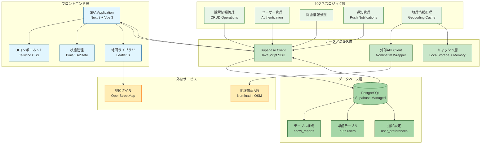

```mermaid
flowchart TD
    subgraph "フロントエンド層"
        FE1[SPA Application<br/>Nuxt 3 + Vue 3]
        FE2[UIコンポーネント<br/>Tailwind CSS]
        FE3[状態管理<br/>Pinia/useState]
        FE4[地図ライブラリ<br/>Leaflet.js]
    end
    
    subgraph "ビジネスロジック層"
        BL1[除雪情報管理<br/>CRUD Operations]
        BL4[ユーザー管理<br/>Authentication]
        BL5[除雪情報参照]
        BL2[通知管理<br/>Push Notifications]
        BL3[地理情報処理<br/>Geocoding Cache]
    end
    
    subgraph "データアクセス層"
        DA1[Supabase Client<br/>JavaScript SDK]
        DA2[外部API Client<br/>Nominatim Wrapper]
        DA3[キャッシュ層<br/>LocalStorage + Memory]
    end
    
    subgraph "データベース層"
        DB1[(PostgreSQL<br/>Supabase Managed)]
        DB2[テーブル構成<br/>snow_reports]
        DB3[認証テーブル<br/>auth.users]
        DB4[通知設定<br/>user_preferences]
    end
    
    subgraph "外部サービス"
        EXT1[地理情報API<br/>Nominatim OSM]
        EXT3[地図タイル<br/>OpenStreetMap]
    end

    %% フロントエンド層内の接続
    FE1 --> FE2
    FE1 --> FE3
    FE1 --> FE4
    
    %% ビジネスロジック層 → データアクセス層
    BL1 --> DA1
    BL2 --> DA1
    BL3 --> DA2
    BL3 --> DA3
    BL4 --> DA1
    BL5 --> DA1
    
    %% データアクセス層 ↔ データベース層（双方向）
    DA1 --> DB1
    DB1 --> DA1
    
    %% フロントエンド層 ↔ データアクセス層（直接アクセス・双方向）
    FE1 --> DA1
    DA1 --> FE1
    
    %% データベース層内の接続
    DB1 --> DB2
    DB1 --> DB3
    DB1 --> DB4
    
    %% 外部サービスへの接続
    DA2 --> EXT1
    FE4 --> EXT3

    %% スタイル定義
    classDef frontend fill:#e1f5fe,stroke:#01579b
    classDef business fill:#e8f5e8,stroke:#2e7d32
    classDef data fill:#c8e6c9,stroke:#1b5e20
    classDef database fill:#a5d6a7,stroke:#0d5016
    classDef external fill:#ffecb3,stroke:#ff6f00
    
    class FE1,FE2,FE3,FE4 frontend
    class BL1,BL2,BL3,BL4,BL5 business
    class DA1,DA2,DA3 data
    class DB1,DB2,DB3,DB4 database
    class EXT1,EXT3 external
```
