# わっかない除雪情報システム - ユースケース図

## 概要
本ドキュメントは、わっかない除雪情報システムのユースケース図を示しています。
システム構成図（Fullsystem.drawio）を基に、システム内部の機能に焦点を当ててユースケースを定義しています。

## システム境界
- **システム名**: わっかない除雪情報システム
- **対象範囲**: システム内部機能のみ（外部サービスとの連携は除く）

## アクター定義

### 1. 一般利用者
- **説明**: 稚内市の住民や訪問者（統合）
- **目的**: 除雪情報の確認と通知受信
- **権限**: 閲覧権限、通知設定権限

### 2. 管理者
- **説明**: 除雪情報の管理を行う管理者
- **目的**: 除雪情報の登録・編集・削除、システム管理
- **権限**: 管理権限（CRUDすべて）、一般利用者のすべての機能

### 3. システム
- **説明**: 自動処理を行うシステム
- **目的**: リアルタイム通知配信、キャッシュ管理
- **権限**: システム内部処理権限

## ユースケース図

```mermaid
flowchart TB
    %% アクター定義（システム外部）
    User[("一般利用者")]
    Admin[("管理者")]
    System[("システム")]
    
    %% システム境界
    subgraph WakkanaiSystem["わっかない除雪情報システム"]
        direction TB
        
        %% 認証関連ユースケース
        subgraph AuthGroup["認証機能"]
            Login((("ログイン")))
            Logout((("ログアウト")))
            AuthCheck((("認証確認")))
        end
        
        %% 閲覧関連ユースケース
        subgraph ViewGroup["情報閲覧機能"]
            ViewSnowInfo((("除雪情報を<br/>閲覧する")))
            ViewMap((("地図上で除雪<br/>エリアを確認する")))
            ViewHistory((("除雪履歴を<br/>確認する")))
        end
        
        %% 通知関連ユースケース
        subgraph NotificationGroup["通知機能"]
            ManageNotification((("通知設定を<br/>管理する")))
            ViewNotificationHistory((("通知履歴を<br/>確認する")))
            ReceiveNotification((("リアルタイム通知<br/>を受信する")))
        end
        
        %% 管理機能ユースケース
        subgraph AdminGroup["管理機能"]
            CreateSnowInfo((("除雪情報を<br/>登録する")))
            EditSnowInfo((("除雪情報を<br/>編集する")))
            DeleteSnowInfo((("除雪情報を<br/>削除する")))
            ManageUsers((("ユーザーを<br/>管理する")))
        end
        
        %% システム自動処理ユースケース
        subgraph SystemGroup["システム機能"]
            SendNotification((("リアルタイム通知<br/>を配信する")))
            CacheGeoInfo((("地理情報を<br/>キャッシュする")))
            MaintainAuth((("認証状態を<br/>維持する")))
            CheckNotificationSettings((("通知設定を<br/>確認する")))
        end
    end
    
    %% 一般利用者の関連
    User --- Login
    User --- Logout
    User --- ViewSnowInfo
    User --- ViewMap
    User --- ViewHistory
    User --- ManageNotification
    User --- ViewNotificationHistory
    User --- ReceiveNotification
    
    %% 管理者の関連
    Admin --- CreateSnowInfo
    Admin --- EditSnowInfo
    Admin --- DeleteSnowInfo
    Admin --- ManageUsers
    Admin --- Login
    Admin --- Logout
    Admin --- ViewSnowInfo
    Admin --- ViewMap
    Admin --- ViewHistory
    Admin --- ManageNotification
    Admin --- ViewNotificationHistory
    Admin --- ReceiveNotification
    
    %% システムの関連
    System --- SendNotification
    System --- CacheGeoInfo
    System --- MaintainAuth
    
    %% include関係（点線矢印）
    CreateSnowInfo -.->|"<<include>>"| AuthCheck
    EditSnowInfo -.->|"<<include>>"| AuthCheck
    DeleteSnowInfo -.->|"<<include>>"| AuthCheck
    ManageUsers -.->|"<<include>>"| AuthCheck
    SendNotification -.->|"<<include>>"| CheckNotificationSettings
    
    %% extend関係（点線矢印）
    CacheGeoInfo -.->|"<<extend>>"| ViewMap
    
    %% スタイリング
    classDef actor fill:#e1f5fe,stroke:#01579b,stroke-width:3px,color:#000
    classDef usecase fill:#f3e5f5,stroke:#4a148c,stroke-width:2px,color:#000
    classDef system fill:#e8f5e8,stroke:#2e7d32,stroke-width:2px,color:#000
    classDef boundary fill:#fff3e0,stroke:#e65100,stroke-width:3px,color:#000
    
    %% スタイル適用
    class User,Admin,System actor
    class Login,Logout,ViewSnowInfo,ViewMap,ViewHistory,ManageNotification,ViewNotificationHistory,ReceiveNotification,CreateSnowInfo,EditSnowInfo,DeleteSnowInfo,ManageUsers usecase
    class SendNotification,CacheGeoInfo,MaintainAuth,AuthCheck,CheckNotificationSettings system
    class WakkanaiSystem boundary
```

## ユースケース詳細

### 一般利用者のユースケース

#### UC-001: ログイン
- **目的**: システムにログインして認証を受ける
- **事前条件**: 有効なアカウントを持っている
- **事後条件**: 認証されたセッションが確立される

#### UC-002: ログアウト
- **目的**: システムからログアウトする
- **事前条件**: ログイン済み
- **事後条件**: セッションが無効化される

#### UC-003: 除雪情報を閲覧する
- **目的**: 最新の除雪作業状況を確認する
- **事前条件**: なし（匿名アクセス可能）
- **事後条件**: 除雪情報が表示される

#### UC-004: 地図上で除雪エリアを確認する
- **目的**: 地図上で除雪作業エリアを視覚的に確認する
- **事前条件**: なし
- **事後条件**: 地図上に除雪エリアが表示される
- **拡張**: 地理情報キャッシュによる高速表示

#### UC-005: 除雪履歴を確認する
- **目的**: 過去の除雪作業履歴を確認する
- **事前条件**: なし
- **事後条件**: 履歴データが日付順で表示される

#### UC-006: 通知設定を管理する
- **目的**: プッシュ通知の受信設定を管理する
- **事前条件**: ログイン済み
- **事後条件**: 通知設定が更新される

#### UC-007: 通知履歴を確認する
- **目的**: 受信した通知の履歴を確認する
- **事前条件**: ログイン済み
- **事後条件**: 通知履歴が表示される

#### UC-008: リアルタイム通知を受信する
- **目的**: 除雪開始・終了の通知をリアルタイムで受信する
- **事前条件**: 通知設定が有効
- **事後条件**: 通知が受信・表示される

### 管理者のユースケース

#### UC-101: 除雪情報を登録する
- **目的**: 新しい除雪作業情報を登録する
- **事前条件**: 管理者としてログイン済み
- **事後条件**: 新しい除雪情報がデータベースに保存される
- **包含**: 認証確認

#### UC-102: 除雪情報を編集する
- **目的**: 既存の除雪情報を編集する
- **事前条件**: 管理者としてログイン済み、編集対象が存在
- **事後条件**: 除雪情報が更新される
- **包含**: 認証確認

#### UC-103: 除雪情報を削除する
- **目的**: 不要な除雪情報を削除する
- **事前条件**: 管理者としてログイン済み、削除対象が存在
- **事後条件**: 除雪情報が削除される
- **包含**: 認証確認

#### UC-104: ユーザーを管理する
- **目的**: システムユーザーの管理を行う（将来機能）
- **事前条件**: 管理者としてログイン済み
- **事後条件**: ユーザー情報が管理される
- **包含**: 認証確認

### システムのユースケース

#### UC-201: リアルタイム通知を配信する
- **目的**: 除雪作業の開始・終了を自動通知する
- **事前条件**: 除雪情報の変更が発生
- **事後条件**: 対象ユーザーに通知が配信される
- **包含**: 通知設定を確認する

#### UC-202: 地理情報をキャッシュする
- **目的**: 地図表示の高速化のため地理情報をキャッシュする
- **事前条件**: 地理情報APIからのデータ取得
- **事後条件**: キャッシュに地理情報が保存される

#### UC-203: 認証状態を維持する
- **目的**: ユーザーの認証状態を維持・管理する
- **事前条件**: ユーザーのログイン
- **事後条件**: セッション情報が適切に管理される

## ユースケース関係

### 継承関係
- 管理者は一般利用者のすべての機能を継承
- 管理者のみが管理機能（UC-101〜UC-104）にアクセス可能

### 包含関係（<<include>>）
- 管理機能（UC-101〜UC-104）は認証確認を包含
- リアルタイム通知配信（UC-201）は通知設定確認を包含

### 拡張関係（<<extend>>）
- 地理情報キャッシュ（UC-202）は地図表示（UC-004）を拡張

## 制約事項
1. 認証機能は将来的に実装される前提
2. 現在は認証チェックが無効化されているが、管理機能には認証が必要
3. システム内部機能のみを対象とし、外部サービス連携は除外
4. 通知機能は段階的実装予定

## 更新履歴
- 2024-12-19: 初版作成
- システム構成図（Fullsystem.drawio）を基に作成
- 認証機能を含む前提で設計
