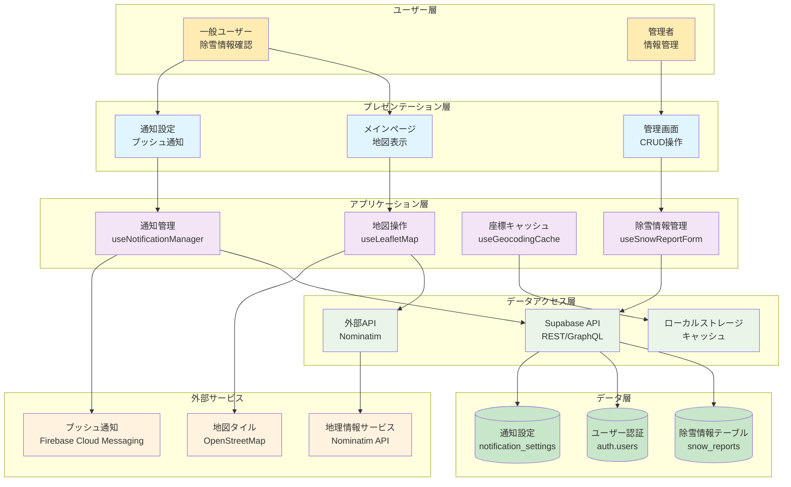

```mermaid
    flowchart TD
        subgraph "ユーザー層"
            U1[一般ユーザー<br/>除雪情報確認]
            U2[管理者<br/>情報管理]
        end
        
        subgraph "プレゼンテーション層"
            P1[メインページ<br/>地図表示]
            P2[管理画面<br/>CRUD操作]
            P3[通知設定<br/>プッシュ通知]
        end
        
        subgraph "アプリケーション層"
            A1[除雪情報管理<br/>useSnowReportForm]
            A2[地図操作<br/>useLeafletMap]
            A3[座標キャッシュ<br/>useGeocodingCache]
            A4[通知管理<br/>useNotificationManager]
        end
        
        subgraph "データアクセス層"
            D1[Supabase API<br/>REST/GraphQL]
            D2[外部API<br/>Nominatim]
            D3[ローカルストレージ<br/>キャッシュ]
        end
        
        subgraph "データ層"
            DB1[(除雪情報テーブル<br/>snow_reports)]
            DB2[(ユーザー認証<br/>auth.users)]
            DB3[(通知設定<br/>notification_settings)]
        end
        
        subgraph "外部サービス"
            ES1[地理情報サービス<br/>Nominatim API]
            ES2[プッシュ通知<br/>Firebase Cloud Messaging]
            ES3[地図タイル<br/>OpenStreetMap]
        end
        
        U1 --> P1
        U2 --> P2
        U1 --> P3
        
        P1 --> A2
        P2 --> A1
        P3 --> A4
        
        A1 --> D1
        A2 --> D2
        A3 --> D3
        A4 --> D1
        
        D1 --> DB1
        D1 --> DB2
        D1 --> DB3
        D2 --> ES1
        A4 --> ES2
        A2 --> ES3
        
        classDef user fill:#ffecb3
        classDef presentation fill:#e1f5fe
        classDef application fill:#f3e5f5
        classDef dataaccess fill:#e8f5e8
        classDef database fill:#c8e6c9
        classDef external fill:#fff3e0
        
        class U1,U2 user
        class P1,P2,P3 presentation
        class A1,A2,A3,A4 application
        class D1,D2,D3 dataaccess
        class DB1,DB2,DB3 database
        class ES1,ES2,ES3 external
```