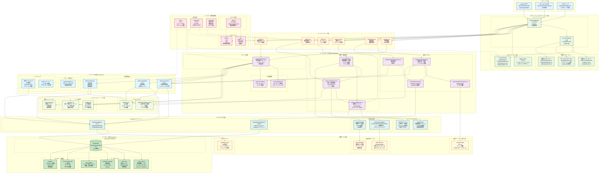

```mermaid
graph TB
    %% ==============================================
    %% クライアント層
    %% ==============================================
    subgraph "クライアント層"
        C1["Webブラウザ<br/>Chrome/Firefox/Safari<br/>JavaScript ES2022"]
        C2["モバイルブラウザ<br/>iOS Safari/Android Chrome<br/>PWA対応"]
        C3["デスクトップ<br/>Windows/macOS/Linux<br/>レスポンシブ対応"]
    end

    %% ==============================================
    %% フロントエンド アプリケーション層
    %% ==============================================
    subgraph "フロントエンド アプリケーション層"
        direction TB
        
        subgraph "メインアプリケーション"
            F1["Nuxt 3 Application<br/>v3.14.159<br/>app.vue<br/>SSR無効化"]
            F2["Vue 3 Framework<br/>latest<br/>Composition API<br/>TypeScript"]
        end
        
        subgraph "UIコンポーネント層"
            F3["Tailwind CSS<br/>v3.4.14<br/>ユーティリティファースト<br/>レスポンシブデザイン"]
            F4["UI Components<br/>components/ui/<br/>AreaNameDisplay.vue<br/>InformationIcon.vue<br/>MainNavigation.vue"]
        end
        
        subgraph "機能コンポーネント"
            F5["地図コンポーネント<br/>SnowLocationMap.vue<br/>Leaflet.js v1.9.4<br/>nuxt-leaflet v0.0.27"]
            F6["フォームコンポーネント<br/>SnowReportForm.vue<br/>バリデーション付き<br/>TypeScript型安全"]
            F7["通知コンポーネント<br/>NotificationHistory.vue<br/>NotificationSettings.vue<br/>NotificationToast.vue"]
        end
    end

    %% ==============================================
    %% ページルーティング層
    %% ==============================================
    subgraph "ページルーティング層"
        P1["index.vue<br/>ホームページ<br/>メイン画面"]
        P2["josetsu.vue<br/>除雪情報ページ<br/>地図表示"]
        P3["create.vue<br/>情報登録ページ<br/>フォーム画面"]
        P4["snowlist.vue<br/>管理画面<br/>CRUD操作"]
        P5["notifications.vue<br/>通知設定<br/>購読管理"]
        P6["cache-test.vue<br/>開発テスト<br/>キャッシュ検証"]
    end

    %% ==============================================
    %% ビジネスロジック層 (Composables)
    %% ==============================================
    subgraph "ビジネスロジック層 (Composables)"
        direction TB
        
        subgraph "フォーム管理"
            BL1["useSnowReportForm.ts<br/>除雪報告フォーム<br/>バリデーション<br/>送信処理"]
        end
        
        subgraph "地図・位置情報"
            BL2["useLeafletMap.ts<br/>地図初期化・操作<br/>マーカー管理<br/>イベント処理"]
            BL3["useGeocodingService.ts<br/>住所⇔座標変換<br/>Nominatim API<br/>レート制限"]
            BL4["useGeocodingCache.ts<br/>座標キャッシュ<br/>localStorage<br/>パフォーマンス向上"]
        end
        
        subgraph "通知システム"
            BL5["useNotificationManager.ts<br/>通知作成・管理<br/>リアルタイム配信"]
            BL6["useNotificationHistoryService.ts<br/>履歴管理<br/>永続化"]
            BL7["useRealtimeListener.ts<br/>Supabase Realtime<br/>WebSocket接続"]
            BL8["usePushNotificationService.ts<br/>Firebase FCM<br/>ブラウザ通知"]
        end
        
        subgraph "UI状態管理"
            BL9["useLoadingState.ts<br/>ローディング管理<br/>エラーハンドリング"]
            BL10["useErrorHandler.ts<br/>エラーメッセージ<br/>ユーザー通知"]
        end
    end

    %% ==============================================
    %% サーバーAPI層
    %% ==============================================
    subgraph "サーバーAPI層 (Nuxt Server)"
        direction TB
        
        subgraph "除雪情報API"
            API1["/api/snow/create.ts<br/>POST<br/>除雪情報登録<br/>バリデーション付き"]
            API2["/api/snow/update.ts<br/>PUT<br/>情報更新<br/>認証チェック"]
            API3["/api/snow/delete.ts<br/>DELETE<br/>情報削除<br/>権限確認"]
        end
        
        subgraph "テスト・開発API"
            API4["/api/test/cleanup.ts<br/>テストデータクリア<br/>開発環境専用"]
        end
        
        subgraph "ミドルウェア"
            API5["認証ミドルウェア<br/>JWT検証<br/>Supabase Auth<br/>セッション管理"]
            API6["APIモニタリング<br/>リクエスト監視<br/>パフォーマンス計測"]
        end
    end

    %% ==============================================
    %% データアクセス層
    %% ==============================================
    subgraph "データアクセス層"
        direction TB
        
        subgraph "Supabaseクライアント"
            DA1["@nuxtjs/supabase<br/>v1.4.6<br/>useSupabaseClient()<br/>useSupabaseUser()"]
            DA2["@supabase/supabase-js<br/>v2.48.1<br/>RESTクライアント<br/>Realtimeクライアント"]
        end
        
        subgraph "外部API連携"
            DA3["Nominatim Wrapper<br/>providers/NominatimProvider.ts<br/>レート制限付き<br/>エラーハンドリング"]
            DA4["OpenStreetMap<br/>地図タイル取得<br/>HTTPS通信<br/>CDN配信"]
        end
        
        subgraph "キャッシュシステム"
            DA5["localStorage<br/>地理情報キャッシュ<br/>ブラウザ永続化<br/>容量制限管理"]
            DA6["メモリキャッシュ<br/>一時的データ保存<br/>セッション内有効<br/>高速アクセス"]
        end
    end

    %% ==============================================
    %% データベース層
    %% ==============================================
    subgraph "データベース層 (Supabase)"
        direction TB
        
        subgraph "PostgreSQL Database"
            DB1[("PostgreSQL<br/>Supabase Managed<br/>v15+<br/>ACID準拠")]
        end
        
        subgraph "データテーブル"
            DB2["snow_reports<br/>除雪情報テーブル<br/>id, area, start_time,<br/>end_time, created_at"]
            DB3["auth.users<br/>認証ユーザー<br/>Supabase Auth<br/>自動管理"]
            DB4["notification_settings<br/>通知設定<br/>user_id, areas,<br/>enabled"]
            DB5["user_profiles<br/>ユーザープロファイル<br/>権限・設定情報"]
        end
        
        subgraph "データベース機能"
            DB6["Row Level Security<br/>RLS有効<br/>ユーザー別<br/>アクセス制御"]
            DB7["Realtime<br/>リアルタイム配信<br/>WebSocket<br/>変更通知"]
        end
    end

    %% ==============================================
    %% 外部サービス層
    %% ==============================================
    subgraph "外部サービス層"
        direction TB
        
        subgraph "認証サービス"
            EXT1["Supabase Auth<br/>JWT認証<br/>ソーシャルログイン<br/>セッション管理"]
        end
        
        subgraph "地理情報サービス"
            EXT2["Nominatim API<br/>OpenStreetMap<br/>住所ジオコーディング<br/>逆ジオコーディング"]
            EXT3["OpenStreetMap<br/>地図タイル配信<br/>オープンソース<br/>無料利用"]
        end
        
        subgraph "通知サービス（実装予定）"
            EXT4["Firebase FCM<br/>v11.2.0<br/>プッシュ通知<br/>クロスプラットフォーム"]
        end
    end

    %% ==============================================
    %% インフラ・開発環境層
    %% ==============================================
    subgraph "インフラ・開発環境層"
        direction TB
        
        subgraph "コンテナ環境"
            INF1["Docker<br/>Dockerfile<br/>docker-compose.yml<br/>開発環境統一"]
        end
        
        subgraph "ビルドツール"
            INF2["Vite<br/>高速ビルド<br/>HMR対応<br/>最適化"]
            INF3["Node.js<br/>v18+<br/>npm<br/>依存関係管理"]
        end
        
        subgraph "品質管理"
            INF4["Vitest<br/>v3.1.3<br/>ユニットテスト<br/>カバレッジ計測"]
            INF5["Playwright<br/>v1.54.1<br/>E2Eテスト<br/>クロスブラウザ"]
            INF6["TypeScript<br/>型安全性<br/>開発効率<br/>エラー防止"]
        end
    end

    %% ==============================================
    %% ユーティリティ・ツール層
    %% ==============================================
    subgraph "ユーティリティ・ツール層"
        direction TB
        
        subgraph "データ処理"
            UTIL1["formatters.ts<br/>日付・時刻フォーマット<br/>データ表示用<br/>国際化対応"]
            UTIL2["validators.ts<br/>入力値検証<br/>セキュリティ<br/>データ整合性"]
        end
        
        subgraph "パフォーマンス"
            UTIL3["TokenBucketRateLimiter.ts<br/>API呼び出し制限<br/>レート制御<br/>サービス保護"]
            UTIL4["apiMonitor.ts<br/>API監視<br/>パフォーマンス<br/>ログ収集"]
        end
        
        subgraph "通知ユーティリティ"
            UTIL5["notificationUtils.ts<br/>通知ヘルパー<br/>共通処理<br/>再利用性"]
        end
    end

    %% ==============================================
    %% 接続関係の定義
    %% ==============================================
    
    %% クライアント ↔ フロントエンド
    C1 --> F1
    C2 --> F1
    C3 --> F1
    
    %% フロントエンド内部接続
    F1 --> F2
    F1 --> F3
    F2 --> F4
    F2 --> F5
    F2 --> F6
    F2 --> F7
    
    %% ページルーティング
    F1 --> P1
    F1 --> P2
    F1 --> P3
    F1 --> P4
    F1 --> P5
    F1 --> P6
    
    %% ページ ↔ ビジネスロジック
    P2 --> BL2
    P2 --> BL3
    P3 --> BL1
    P4 --> BL1
    P5 --> BL5
    P5 --> BL6
    P6 --> BL4
    
    %% ビジネスロジック内部接続
    BL1 --> BL9
    BL1 --> BL10
    BL2 --> BL3
    BL2 --> BL4
    BL3 --> BL4
    BL5 --> BL7
    BL5 --> BL8
    BL6 --> BL7
    
    %% ビジネスロジック ↔ API
    BL1 --> API1
    BL1 --> API2
    BL1 --> API3
    BL5 --> API1
    BL6 --> API1
    
    %% API ↔ データアクセス
    API1 --> DA1
    API2 --> DA1
    API3 --> DA1
    API5 --> DA1
    
    %% ビジネスロジック ↔ データアクセス（直接アクセス）
    BL2 --> DA4
    BL3 --> DA3
    BL4 --> DA5
    BL4 --> DA6
    BL7 --> DA2
    
    %% データアクセス ↔ データベース
    DA1 --> DB1
    DA2 --> DB1
    
    %% データベース内部接続
    DB1 --> DB2
    DB1 --> DB3
    DB1 --> DB4
    DB1 --> DB5
    DB1 --> DB6
    DB1 --> DB7
    
    %% データアクセス ↔ 外部サービス
    DA1 --> EXT1
    DA3 --> EXT2
    DA4 --> EXT3
    BL8 --> EXT4
    
    %% ビジネスロジック ↔ ユーティリティ
    BL1 --> UTIL1
    BL1 --> UTIL2
    BL3 --> UTIL3
    BL5 --> UTIL5
    API1 --> UTIL4
    API2 --> UTIL4
    API3 --> UTIL4
    
    %% インフラ・開発環境
    F1 -.-> INF2
    F1 -.-> INF3
    INF1 -.-> INF2
    INF1 -.-> INF3
    
    %% テスト関係
    INF4 -.-> F4
    INF4 -.-> BL1
    INF4 -.-> UTIL1
    INF5 -.-> P1
    INF5 -.-> P2
    INF5 -.-> P3
    
    %% ==============================================
    %% スタイル定義
    %% ==============================================
    
    %% クライアント層
    classDef client fill:#e3f2fd,stroke:#1976d2,stroke-width:2px,color:#000
    class C1,C2,C3 client
    
    %% フロントエンド層
    classDef frontend fill:#e8f5e8,stroke:#2e7d32,stroke-width:2px,color:#000
    class F1,F2,F3,F4,F5,F6,F7 frontend
    
    %% ページ層
    classDef pages fill:#fff3e0,stroke:#f57c00,stroke-width:2px,color:#000
    class P1,P2,P3,P4,P5,P6 pages
    
    %% ビジネスロジック層
    classDef business fill:#f3e5f5,stroke:#7b1fa2,stroke-width:2px,color:#000
    class BL1,BL2,BL3,BL4,BL5,BL6,BL7,BL8,BL9,BL10 business
    
    %% API層
    classDef api fill:#e1f5fe,stroke:#0277bd,stroke-width:2px,color:#000
    class API1,API2,API3,API4,API5,API6 api
    
    %% データアクセス層
    classDef data fill:#e0f2f1,stroke:#00695c,stroke-width:2px,color:#000
    class DA1,DA2,DA3,DA4,DA5,DA6 data
    
    %% データベース層
    classDef database fill:#c8e6c9,stroke:#1b5e20,stroke-width:2px,color:#000
    class DB1,DB2,DB3,DB4,DB5,DB6,DB7 database
    
    %% 外部サービス層
    classDef external fill:#fff8e1,stroke:#ef6c00,stroke-width:2px,color:#000
    class EXT1,EXT2,EXT3,EXT4 external
    
    %% インフラ層
    classDef infra fill:#fce4ec,stroke:#c2185b,stroke-width:2px,color:#000
    class INF1,INF2,INF3,INF4,INF5,INF6 infra
    
    %% ユーティリティ層
    classDef utility fill:#f1f8e9,stroke:#558b2f,stroke-width:2px,color:#000
    class UTIL1,UTIL2,UTIL3,UTIL4,UTIL5 utility
```