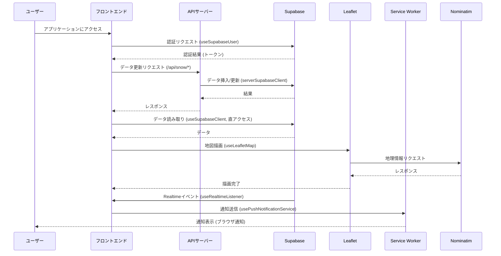

```mermaid
sequenceDiagram
    participant User as ユーザー
    participant Frontend as フロントエンド
    participant API as APIサーバー
    participant Supabase as Supabase
    participant Leaflet as Leaflet
    participant ServiceWorker as Service Worker
    participant Nominatim as Nominatim

    User->>Frontend: アプリケーションにアクセス
    Frontend->>Supabase: 認証リクエスト (useSupabaseUser)
    Supabase-->>Frontend: 認証結果 (トークン)
    Frontend->>API: データ更新リクエスト (/api/snow/*)
    API->>Supabase: データ挿入/更新 (serverSupabaseClient)
    Supabase-->>API: 結果
    API-->>Frontend: レスポンス
    Frontend->>Supabase: データ読み取り (useSupabaseClient, 直アクセス)
    Supabase-->>Frontend: データ
    Frontend->>Leaflet: 地図描画 (useLeafletMap)
    Leaflet->>Nominatim: 地理情報リクエスト
    Nominatim-->>Leaflet: レスポンス
    Leaflet-->>Frontend: 描画完了
    Supabase->>Frontend: Realtimeイベント (useRealtimeListener)
    Frontend->>ServiceWorker: 通知送信 (usePushNotificationService)
    ServiceWorker-->>User: 通知表示 (ブラウザ通知)
```