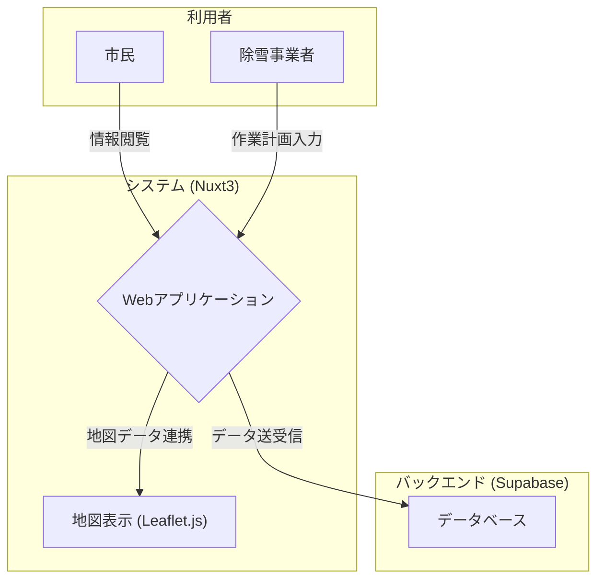

# 卒業論文ポスター内容案

---

### **タイトル案**

**低コストで実現する市民中心の除排雪情報共有システム**

---

### **1. 研究の背景**

*   **除排雪情報の不足:** 豪雪地帯である稚内市では、除排雪作業が「いつ、どこで」行われるか不明瞭なため、市民が移動中に作業現場に遭遇し、不要な待機時間が発生しています。
*   **既存システムの導入コスト:** 従来のGPSを利用した情報共有システムは、高額な初期投資が必要であり、特に予算規模の小さい自治体では導入が困難なのが現状です。

---

### **2. 目的**

本研究では、GPS端末を利用せず、低コストで導入・運用可能な新しい除排雪情報共有システムを開発・提案します。本システムは、市民がリアルタイムで除雪情報を把握し、不要な待機時間を削減すること、そして除雪事業者への問い合わせを減らし、業務効率化に貢献することを目的とします。

---

### **3. 研究計画**

本研究では、提案システムの開発と、その有効性を評価するための実験を行います。

#### **システム構成**

開発するシステムは、Vue.jsベースのフレームワークNuxt3とバックエンドサービスSupabaseを用いて構築します。事業者がWebフォームから入力した除雪計画（地域名、作業期間）はデータベースに即時保存され、市民はWebアプリケーション上の地図（Leaflet.js）で作業地点をピンポイントで確認できます。

#### **評価方法**

システムの有効性を以下の2つの観点から評価します。

1.  **コスト優位性の評価:**
    *   本システムの開発・運用にかかる概算費用を算出します。
    *   算出した費用を、福井県若狭市などの先行事例で導入されているGPSベースのシステム（初期費用約600万円）と比較し、コスト削減効果を定量的に評価します。

2.  **実用性の評価（ユーザビリティテスト）:**
    *   **市民向け評価:** 学部生の卒業研究として実施するため、市民の代理として学内生徒を被験者とします。被験者にシステムを実際に利用してもらい、シナリオタスク（例：「目的地までの経路で除雪が行われているか確認する」）を実行させます。アンケートやヒアリングを通じて、情報の分かりやすさ、操作性、そして「不要な待機時間を削減できるか」といった有効性を評価します。
    *   **事業者向け評価:** 除雪事業者に情報入力フォームを試用してもらい、入力の容易さや業務負荷についてヒアリング調査を行います。

---

### **4. 進捗状況**

研究計画に基づき、提案システムの中核機能を持つプロトタイプを開発しました。

*   **使用技術:** Nuxt3 (Vue.js), Supabase, Leaflet.js
*   **実装済み機能:**
    *   **事業者向け:** 除雪計画（地域名、作業期間）の登録・編集・削除機能
    *   **市民向け:** 登録された除雪計画を一覧および地図上のピンとして閲覧する機能

**(ここにWebアプリケーションのスクリーンショットを挿入)**

*   **図A: 市民向け閲覧画面**
    *   地図上に除雪作業地点がピンで表示され、クリックで詳細情報を確認できる。
*   **図B: 事業者向け管理画面**
    *   登録済みの情報を一覧で確認・編集・削除できる。

---

### **5. 今後の課題・改善策**

プロトタイプの開発と評価計画を通じて、以下の課題と改善策が明らかになりました。

*   **機能面の改善:**
    *   **地図表現の高度化:** 現在のピン表示に加え、作業エリアをポリゴン（面）で表示し、より直感的な情報提供を目指す。
    *   **リアルタイム更新の統合:** Supabase Realtimeを利用したリアルタイム更新機能を閲覧画面に統合し、情報が自動で更新される仕組みを実装する。

*   **評価の深化:**
    *   **ユーザビリティテストの実施:** 研究計画に基づき、学内生徒を対象としたユーザビリティテストを行い、システムの有効性を検証する。
    *   **コスト概算の精緻化:** 先行事例との比較をより明確にするため、本システムの導入・運用にかかる具体的なコストを詳細に算出する。

*   **情報粒度の課題:**
    *   本システムはGPSを利用しないため、車両の「現在位置」は提供できない。この点が市民のニーズにどの程度影響するかを、ユーザビリティテストを通じて検証する。
